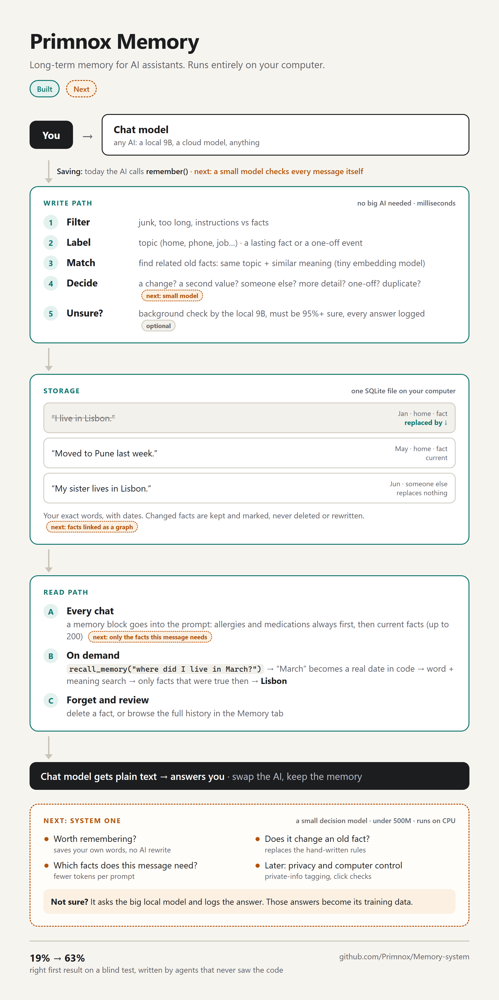

# Primnox Memory System

Long-term memory for a local-first AI assistant. It remembers what you tell it,
notices when a fact has changed ("I moved to Pune" retires "I live in Lisbon"),
keeps the history, and answers questions about the past ("where did I live
back in March?"). It runs entirely on your own machine: SQLite, a small
sentence encoder, and optionally a local model as a second opinion. No cloud.

It was built inside Primnox, a desktop assistant. The app is closed source;
this repo publishes the memory work in the open: the code, the blind test
sets, every score, and the plan for what comes next.

## In short

- **Fully local.** It keeps your exact words with dates and knows when
  something changed, without calling a big AI.
- **Blind tests:** the right fact comes up first **19%** of the time at the
  start, **63%** with the rules and checks in the app today, **80%** with a small
  trained model (421M) deciding what changed plus meaning-based search, and
  **88%** with folders on top (98% in the top 3). The small model catches
  **104 of 112** life changes with **no** wrong retirements, and still 90 of 112
  when the same messages are typed messily.
- **Public benchmarks:** on LongMemEval's knowledge-update pairs it reaches
  F1 **0.78** when given cleanly extracted facts; Gemini 3.1 Pro judging the
  same pairs directly scores 0.80.
- **The biggest lever is extraction.** On real people's chats (REALTALK), turning
  messages into clean facts first makes the right message come up first 34% of
  the time instead of 10%. The extraction in that test used a cloud model; a
  first fine-tuned local extractor (7B) scores 0.67 on LongMemEval, ahead of
  rule splitting (0.55), behind cloud-extracted facts (0.78).
- **Folders on top:** filing facts into folders for people, places and things,
  with an index, is what takes the blind test from 80% to 88%; with a local 3B
  model doing the filing instead of a cloud model, 85% (97% in the top 3).
- **Real chats are the open problem:** on REALTALK, retiring old facts still
  hurts search (45.7% → 42.8% first even with the question deciding which
  retired facts count).
- **Still early:** the small model and the folders are not in the app yet. A
  head-to-head with another open memory system (Hindsight) is set up on the same
  blind test but not run yet; until it is, there is no claim of being better
  than anything else.

**How it differs from other AI memory** (by design; accuracy not yet compared):

| | Keeps | Updates memory with | Local |
|---|---|---|---|
| ChatGPT | a summary of you, rewritten over time | the AI itself | no |
| Claude | old chats, searched when the AI decides to | nothing; it searches raw chats | no |
| Mem0 / Graphiti | facts extracted by an AI | a big AI on every message | yes |
| Hindsight | facts extracted by an AI, in separate networks (world, experiences, observations) | a big AI on every message | yes |
| **Primnox** | **your exact words + dates, filed into folders and slots; old facts kept, marked replaced** | **rules + small models (421M decision model, 3B filing model), no big AI** | **yes** |

## Latest: folder memory (2026-10-08/09)

Memory organised like a person's organiser: every fact is filed into **folders** (people,
pets, places, organisations, things, plus one per speaker) and under one **slot** of one
folder (`Sarah.lives_in`, `me.employer`), with an **index** (days, and a card per folder)
linking it all. A model files facts one at a time, in date order, without ever seeing labels
or later facts.

On the blind test set (171 questions, settings chosen beforehand on a separate dev set):

| How memory is searched | Right fact first | In the top 3 |
|---|---|---|
| Plain similarity | 41.5% | 85.4% |
| Folders + index, no change-detection model | 71.3% | 94.7% |
| Today's memory (round-7 model retiring old facts) | 80.1% | 94.2% |
| Today's memory + folders filed by a **local 3B model** | 84.8% | 97.1% |
| **Today's memory + folders filed by a cloud model** | **87.7%** | **97.7%** |

Folders do not replace the change-detection model; they add to it. (The first version of this
table, 86.0%, used a filing that saw each person's whole history at once; filing one fact at
a time, as the app would, gives the numbers above.)

What did not work, and the open problems:
- **Real chats (REALTALK):** retiring old facts still **hurts** search (45.7% → 40.0% first).
  Letting the question decide whether retired facts count recovers part of it (42.8%).
- **A head trained to read the folders** (round 8) leaned on them and got worse without them
  (99 vs 104 of 112; LongMemEval 0.74 vs 0.78): round 7 stays.
- **The local filing model** works on one person's own facts but fails on chats between two
  people (58% of REALTALK facts left unfiled).
- A retrained local extractor (v2) scored **worse** than v1 on LongMemEval (0.60 vs 0.67).

Details, code and every score: [`folders/`](folders/).

## Round 7 of the change-detection model (2026-10-08)

Round 7 trained on everything at once: the earlier synthetic people, 24 new
people written as real-looking chats with an assistant (facts mentioned in
passing, half the messages about something else), 21 people who mix languages
(Hinglish, Spanglish, Taglish, Arabizi, Pidgin, Singlish…), and messy-typing
copies of all of them (typos, shorthand, half-sentences, voice-to-text slips).
Lives were drawn at random rather than hand-picked, and every label was settled
by a 2-of-3 vote between the writer and two independent auditors. Nothing below
was trained on.

| Test | Round 6 | **Round 7** |
|---|---|---|
| Blind test set, clean: changes noticed · wrongly retired | 103/112 · 0 | **104/112 · 0** |
| Same set, messy typing (identical labels) | 81/112 · 7 | **90/112 · 4** |
| Same set, heavy messy typing | 58/112 · 6 | **82/112 · 6** |
| LongMemEval knowledge-update pairs, F1 (facts extracted by a cloud model) | 0.69 | **0.78** |
| LongMemEval, F1 (messages split by rules, fully local) | 0.51 | 0.55 |
| Dialogue NLI, full test / verified test, F1 | 0.49 / 0.57 | **0.61 / 0.69** |

**For reference, a frontier model on the same tests.** Gemini 3.1 Pro, shown
each person's whole history at once, catches all 112 changes (clean or messy)
and scores F1 0.80 on LongMemEval reading whole messages. The small model judges
one shortlisted pair at a time and runs on a laptop CPU; closing that gap
locally is the current goal.

**Extraction matters more than anything else measured.** The same model on
LongMemEval scores F1 0.11 on whole messages, 0.51 on rule-split sentences and
0.69 on cleanly extracted facts. On REALTALK (10 real 21-day chats between
people; 505 memory questions), the right message comes up first:

| Memory holds | First result right | In top 3 |
|---|---|---|
| Raw messages | 10% | 16% |
| Messages split by rules | 9% | 15% |
| Facts extracted by a model | **34%** | **50%** |

**First local extractors** (QLoRA on the audited chat people), scored on LongMemEval
with the round-7 model:

| Facts written by | F1 | Precision | Recall |
|---|---|---|---|
| A cloud model (Gemini, prompt only) | 0.78 | 0.77 | 0.79 |
| **Qwen 2.5 7B, fine-tuned (local)** | **0.67** | 0.78 | 0.58 |
| Rule-based sentence splitting (local) | 0.55 | 0.71 | 0.44 |
| Qwen 2.5 1.5B, fine-tuned (local) | 0.41 | 0.63 | 0.31 |
| Qwen 2.5 3B, prompt only (local) | 0.38 | 0.78 | 0.25 |

The fine-tuned 7B beats the rules and matches the cloud model's precision, but
writes half as many facts, so it misses updates; the 1.5B is not usable yet.
Data, code, Kaggle jobs and every score: [`round7/`](round7/). REALTALK's
messages are not included (no licence).

## Earlier results: the memory in the app

Measured on a blind test set: written by agents that never saw the code,
labels re-checked independently, frozen by SHA-256 before the first scored run,
and each version scored on it once. Top-1 = the first search result is a right
answer. 95% confidence intervals in brackets.

| Version | Answerable top-1 | "Now" questions | Changes noticed | Wrong retirements |
|---|---|---|---|---|
| Starting point | 19% [14–25] | 14/93 | 16/112 | 55 of 71 |
| Topics, slots, time | 34% [27–41] | 22/93 | 12/112 | 27 of 39 |
| + scale, lifecycle, safety, embeddings | 57% [50–64] | 47/93 | 54/112 | 28 of 82 |
| + change detection | 59% [52–66] | 50/93 | 62/112 | 19 of 81 |
| + time phrases | 59% [52–66] | 50/93 | 62/112 | 19 of 81 |
| **+ background verifier** | **63% [55–69]** | **56/93** | **73/112** | **20 of 93** |

Time phrases show up when the local model writes the search itself: 48% → 53%,
and "back then" questions 24 → 34 of 54 (p=0.002).

### What these numbers do and do not show

- The gains are real: 19% → 63% on a fresh set, p < 0.0001.
- 63% means the top result is still wrong for about 1 in 3 questions, and that
  is with the true date supplied; with a local 9B model writing the search,
  about 53%.
- About 1 in 5 retirements is a mistake.
- These are retrieval scores, not end-to-end answers, on synthetic,
  agent-written conversations (171 answerable questions).
- No comparison with other memory systems yet. LongMemEval knowledge updates
  and REALTALK are now measured (round 7, above); LoCoMo and other memory
  systems are next. Until then there is no claim of being better than anything
  else.

### A small trained model for change detection (first version)

A 421M-parameter decision model (Laya, fine-tuned on synthetic people in ~12
minutes on one free GPU) replaced the hand-written change rules in a blind
replay of the same test set:

| Change detector | Changes noticed | Wrongly retired facts |
|---|---|---|
| Rules | 62/112 (55%) | 19 |
| Rules + local 9B verifier | 73/112 (65%) | 20 |
| **Small trained model** | **95/112 (85%)** | **2** |

With the model's decisions in the memory, the first search result is right
for **66.7%** of blind questions (rules 59.1%, rules + 9B verifier 62.6%,
perfect change detection 70.8%; vs rules paired p = 0.007). Letting the local 9B
override its uncertain decisions only when the 9B is at least 95% sure removes
29% of its remaining errors (a perfect supervisor would remove 80%).

A second training run gave 92/112 with 2 wrong retirements. **On data not
written by Claude the edge shrinks:** F1 0.51 on crowdworker-written facts
(rules 0.26) and 0.24 on long, chatty LongMemEval messages (rules 0.09). The
85% holds for short, clean facts. Adding restatements to the training data cut
"same fact said differently" errors from 17% to 4% (blind set unchanged at
94/112), and splitting long messages into statements before comparing them
raised changes caught in long chat turns from 6 to 33 of 72. Not yet measured: answer accuracy with the model in
the loop, and CPU speed (~0.4 s per comparison).

**Fewer tokens per chat:** sending only the most relevant facts instead of
all of them cuts the memory block by ~45% (small stores) to ~89% (200 facts,
4,075 → ~450 tokens) while keeping 96–97% / 79% of the facts the answers need.
A graph index (facts linked by people, things and topics) did not choose
better prompt facts than plain similarity in a blind test; see [`graph/`](graph/).
Filing facts into folders does improve search, though: see [`folders/`](folders/).

**Research paper** (method, all results with confidence intervals, design
limitations, threats to validity, references): [`docs/RESEARCH.md`](docs/RESEARCH.md); IEEE-style Word
version: [`docs/Primnox_Memory_Research_Paper.docx`](docs/Primnox_Memory_Research_Paper.docx). Full experiment log:
[`docs/MEMORY_EXPERIMENT.md`](docs/MEMORY_EXPERIMENT.md). Every score file:
[`scripts/blind_memory/results/RESULTS.md`](scripts/blind_memory/results/RESULTS.md).

## How it works

- **Write path, no language model needed.** Each new fact is classified (topic, fact or
  one-off event) and compared with what is already stored. Rules plus sentence
  embeddings decide whether it replaces an older fact, is a second value
  (another pet), a refinement, or is about someone else. Replaced facts are
  kept with a link to their successor, not deleted.
- **Optional second opinion.** Pairs the rules are unsure about are queued and
  checked in the background by a local model, which must be at least 95% sure
  from its token probabilities. Every decision is logged.
- **Search.** Hybrid word and embedding ranking, time-aware: "back in March"
  is resolved to a date in code, and only facts true at that date are returned.
- **Not in the app yet** (measured above, see `round7/` and `folders/`): the
  421M decision model replacing the change rules, and folders — every fact filed
  under the people, places and things it is about, searched with that context.
- **Prompt block.** Live facts go into the assistant's prompt, safety-critical
  ones (allergies, medications) first, so they never fall off the end.

## What is in this repo

| Path | What |
|---|---|
| `backend/primnox2/memory/` | Storage, search, prompt block, embeddings, time phrases, verifier, directives |
| `backend/primnox2/cognition/conflict.py`, `topics.py` | Change detection: does a new fact replace an old one |
| `patches/core-integration.patch` | How the memory plugs into the rest of the app (database schema, settings, tools, API) |
| `backend/tests/test_memory_*.py` | The memory test suite |
| `scripts/blind_memory/` | The frozen test sets, dev sets, paraphrase variants, and all results |
| `scripts/bench_memory_blind.py` | The blind-test runner (intervals, paired McNemar, query modes) |
| `scripts/e2e_memory_chat.py` | Full-chat harness: the assistant chats, a judge model grades the answers |
| `docs/RESEARCH.md` | Research paper: protocol, three experiments, threats to validity, references |
| `docs/architecture.png` | Architecture diagram |
| `docs/SYSTEM_ONE_PLAN.md` | The small local decision model (≤500M parameters): plan and status |
| `docs/DATASETS_AND_MODELS.md` | Open datasets, teacher models and starting models for it |
| `graph/` | Graph-index experiment for choosing which facts go into the prompt |
| `system_one/` | The small model: screen, training data, Kaggle training job, blind replay, results |
| `round7/` | Round 7: chat-format and mixed-language people with audited labels, messy-typing test copies, extractor training data, every Kaggle job and score |
| `folders/` | Folder memory: the filing rules, the filing model, folder/index/web search tests, the round-7 model run as the app runs it, extractor v2, every score |

**Can I run it?** Not on its own yet. The memory modules import a few parts of
the Primnox app that are not published (database layer, settings, tool
registry), so the code and tests here are for reading. A standalone package is
the next milestone. The test sets and score files are usable by anyone: the
format is described in [`scripts/blind_memory/README.md`](scripts/blind_memory/README.md).

## Roadmap

1. **A local fact extractor**, so every message becomes clean facts without a
   cloud model and without depending on the chat model deciding to call
   `remember`. Measured as the biggest lever (above); the first fine-tuned 7B
   reaches 0.67 (rules 0.55, cloud 0.78) and needs more recall. A second
   version scored lower (0.60); next, train it on the cloud model's own
   extractions of non-benchmark chats.
2. **Folder memory in the app**: folders, slots and the index on top of the
   change model (88% / 98% on the blind set; 85% / 97% with a local 3B model
   filing), let the question decide whether retired facts count, and teach the
   local filing model conversations between several people.
3. **Close the gap to a frontier model on LongMemEval locally** (0.78 → beyond
   0.80): give the change decision more context than one pair at a time.
4. A standalone package: `pip install`, `remember / search / forget` on SQLite.
5. Public benchmarks: LongMemEval knowledge updates and REALTALK are measured
   (above); next, the head-to-head with Hindsight on the same blind test, then
   LoCoMo.
6. The small local decision model (≤500M parameters): rounds 6–7 trained and
   blind-tested (above); next, wire it into the memory service, make it faster,
   then the "worth keeping?", context, privacy and computer-use heads — see
   [`docs/SYSTEM_ONE_PLAN.md`](docs/SYSTEM_ONE_PLAN.md).

## Licence

Business Source License 1.1 — see [`LICENSE`](LICENSE). Non-commercial use,
including personal, educational and research use, is permitted.
